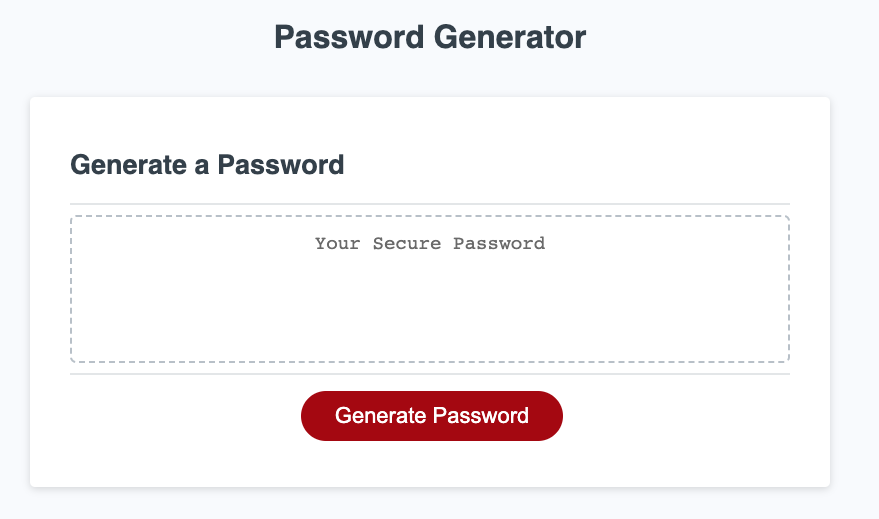

# Password_Generator_JO

## Generate a Random Password Matching User Criteria

A password generator which includes:

- Prompts asking the user how long they would like the password to be and which types of characters they would like it to include
- Alerts if the length is outside the range for the generator or no character types have been selected
- Once the user has made their selections, the password is displayed and can be selected for copying
- The HTML, CSS, and a bit of Javascript were provided for this challenge and Javascript was used to complete it

## Usage

The following link can be used to view the webpage: 
https://jessicaob.github.io/Password_Generator_JO/ 

Here is a screenshot of the completed project: 

## Credits

Thank you to University of Arizona Bootcamp for providing this challenge.

## License

MIT License
